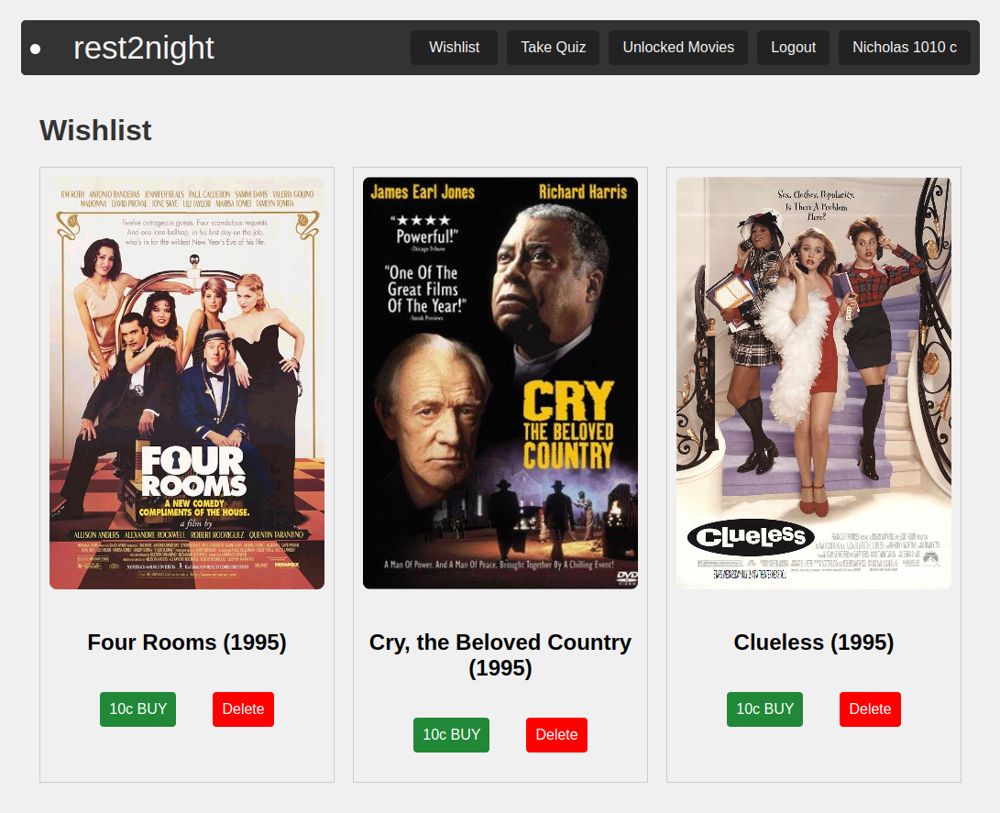

# 🎬 Movie Application - Rest2Night

Welcome to Rest2Night, your ultimate destination for a personalized and enjoyable movie experience! Our application allows you to explore a diverse selection of films, manage your favorites, engage with the community through quizzes, and access exclusive content using our unique coin system.

## 🌐 Front-End Access

You can access the Rest2Night front-end application through the following link:
[Rest2Night Front-End](https://usmonali4.github.io/rest2day/main)

Visit this link to start exploring our extensive catalog of movies, manage your wishlist, participate in quizzes, and more. This front-end provides an intuitive and engaging interface for all your movie needs.


## 📑 Table of Contents

1. [Introduction](#introduction) 🎥
2. [Features](#features) 🌟
3. [Getting Started](#getting-started) 🔧
4. [How to Use](#how-to-use) 📊
   - [Navigating the Main Page](#navigating-the-main-page) 🏠
   - [Exploring Movie Pages](#exploring-movie-pages) 🎥
   - [Managing Your Wishlist](#managing-your-wishlist) 💖
   - [Participating in Quizzes](#participating-in-quizzes) ❓
5. [Movie Recommendations](#movie-recommendations) 💡
6. [Account Management](#account-management) 🔒
7. [Understanding the Coin System](#understanding-the-coin-system) 💰
8. [Using Filters to Discover Movies](#using-filters-to-discover-movies) 🔍

## 🎥 Introduction

Rest2Night is designed to cater to movie enthusiasts who cherish a personalized approach to entertainment. Our platform not only allows you to explore and watch movies but also to interact with other users, share opinions, and participate in engaging community activities.

## 🌟 Features

- **Browse Extensively**: Navigate through an extensive catalog of movies.
- **Detailed Movie Insights**: Access detailed information about movies including synopses, cast, and user reviews.
- **Interactive Wishlist**: Save your favorite movies to a personalized wishlist.
- **Community Engagement**: Rate movies, leave comments, and see what others think.
- **Daily Quizzes**: Test your movie knowledge and earn coins.
- **Exclusive Access**: Use coins to unlock special content.
- **Customized Discovery**: Use filters to discover movies based on your interests.

## 🔧 Getting Started

To get started with Rest2Night, follow these steps:

1. **Installation**:
   Clone our repository to access the application:
   ```bash
   git clone https://github.com/cse364-unist/projects-group12.git
## 📊 How to Use

### 🏠 Navigating the Main Page

The main page is your gateway to all available movies:
- **View Details**: Discover more about a movie by clicking "View Details".
- **Add to Wishlist**: Save to your wishlist for later viewing.


### 🎥 Exploring Movie Pages

Each movie page offers rich information and community features:
- **Rate the Movie**: Submit your rating and contribute to the community consensus.
- **Comments**: Share your thoughts and read others' insights.

### 💖 Managing Your Wishlist

Your wishlist keeps track of your must-watch movies:
- **Access and Watch**: Directly access movies from your wishlist.
- **Remove Titles**: Keep your list tidy by removing watched or unwanted titles.


### ❓ Participating in Quizzes

Engage with daily quizzes to earn coins:
- **Answer Questions**: Each correct answer rewards you with coins.


### 💡 Movie Recommendations

Discover movies that perfectly match your preferences and current mood with our sophisticated recommendation engine. Rest2Night offers personalized movie suggestions based  on a variety of demographic and occasion-based factors:


- **Demographic-Based Recommendations**:
  - **Gender**: Find films that resonate more with specific genders, whether it's action-packed blockbusters or romantic dramas.
  - **Age**: Our selections cater to all age groups, ensuring appropriate and appealing content for children, teens, adults, and seniors.
  - **Occupation**: Discover movies that feature protagonists in professions similar to yours, from thrilling tales of entrepreneurs to day-in-the-life stories of medical professionals.
  - **Genre**: Whether you're in the mood for horror, comedy, adventure, or a documentary, our app has you covered with an extensive genre-based search feature.

- **Occasion-Based Recommendations**:
  - **Family Night**: Choose from a range of family-friendly movies that are perfect for viewing with all age groups, ensuring a fun and engaging experience for everyone.
  - **Date Night**: Select romantic or adventurous movies that set the perfect tone for an evening with that special someone.

Our recommendations are dynamically tailored to ensure you always have access to films that suit your mood and setting. Whether you're planning a quiet night in or a big family gathering, Rest2Night makes finding the right movie effortless. Dive into a personalized cinema experience that anticipates your needs and enhances your movie-watching pleasure.

### 🔒 Account Management

To participate fully, including adding to your wishlist and participating in quizzes, you need to be logged in:
- **Login/Register**: Easily access or create your account using the login/register options.


### 💰 Understanding the Coin System

The coin system is central to unlocking premium content:
- **Earn**: Participate in quizzes to earn coins.
- **Spend**: Use your coins to access exclusive movies.

### 🔍 Using Filters to Discover Movies

Tailor your movie browsing experience using filters:
- **Genres and More**: Choose from genres, age recommendations, or even character occupation to find your next movie.

Enjoy exploring and engaging with the world of cinema with Rest2Night!

